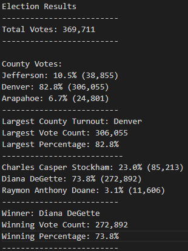

# ELECTION ANALYSIS
## Resources

- **Data Source:** election_results.csv
- **Software:** Python 3.8.8, Visual Studio Code

## Challenge Overview

### Overview of Election Audit

The Colorado Board of Election assigned Tom and me to work together. The Board has tasked us with completing an audit of a congressional precinct in Colorado.  The audit includes calculating the:

1) Calculate the total number of votes cast.
2) Get a complete list of candidates and counties who received votes
3) Calculate the number of votes each candidate and county won.
4) Calculate the percent total number of votes each candidate and county won.
5) Determine the winner of the election based on the popular vote.
6) Determine the largest county turnout based on the popular vote. 

### Election-Audit Results 

The analysis of the election shows that:

[Election-Audit Results Link](analysis/election_analysis.txt)

- There were 369,711 votes cast in the election.
- The counties were:
  - Jefferson
  - Denver
  - Arapahoe
- The county results:
  - Jefferson received 10.5% of the vote and 38,855 votes.
  - Denver received 82.8% of the vote and 306,055 votes.
  - Arapahoe received 6.7% of the vote and 24,801 votes.
- The largest county turnout was:
  - Denver received 82.8% of the vote and 306,055 votes.
- The candidates were:
  - Charles Casper Stockham
  - Diana DeGette
  - Raymon Anthony Doane 
- The candidate results were:
  - Charles Casper Stockham received 23.0% of the vote and 85,213 votes.
  - Diana DeGette received 73.8% of the vote and 272,892 votes.
  - Raymon Anthony Doane received 3.1% of the vote and 11,606 votes.
- The winner of the election was:
  - Diana DeGette received 73.8% of the vote and 272,892 votes.

## Challenge Summary

### Election-Audit Summary

While the audit is generally done in excel, the Board wants us to use Python to automate this process and apply it to future elections and larger elections like Senate races. Excel is only limited to a million rows, so once the results are compiled into the CSV file, we wouldn't be able to do the audit on more significant elections like Senate races. Therefore, completing the audit in Python is the best method to conducting the audit for elections with more than a million votes cast.

